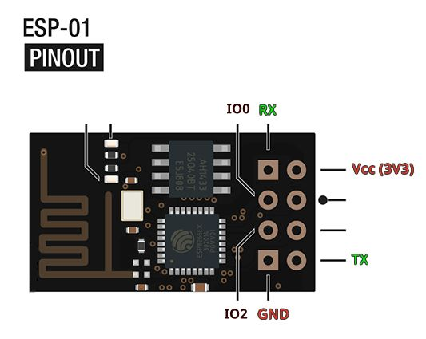

# ESP8266-01 WiFi Serial Bridge
Simple device meant to provide serial access by creating a WiFi access point and talking serial via TCP

The device made to be configurable using a menu available via TCP on port 20, the serial is available at port 23

# Usage
1. Connect it to whatever serial device you wish
2. Connect to it's WiFi AP (default password is `password`)
3. Open TCP `192.168.1.1:20` for setup <!-- TODO add asciicinema recording as a gif -->
```
$ nc 192.168.1.1 20
ESP8266 Wifi Serial Bridge Setup
w) WiFi AP options
b) Serial baud rate (115200)
c) Serial config (8N1)

s) Save to EEPROM
d) Restore default settings
r) Reboot
p) Programming mode
q) Quit

Choose an option:
```
4. Open TCP `192.168.1.1:23` for serial
```
$ nc 192.168.1.1 23
Hello

```

## WiFi Terminal
Whole goal for this project was to be able to fix/configure headless machines without use of wifi or network

> **NOTE:** You can set `export TERM=xterm-256color` so you get proper terminal experience
> **NOTE:** Run `eval $(resize)` when you resize the terminal

1. Wire up ESP to a USB to serial adapter (like `CH340` for example) (**use a proper power supply for the ESP!**)
2. Enable console via serial using `console=/dev/ttyUSB0` as kernel param or `systemctl start serial-getty@ttyUSB0`
3. Connect to the ESP using WiFi

### Linux
4. Connect to it using `nc` or client of your choice (*telnet also works*)

### Android
> **WARNING:** Do not use play store version of termux, it is outdated and more limited

5. Connect to the ESP using wifi
6. Open [Termux](https://termux.dev/en/) and run `nc 192.168.1.1 23`

# Wiring
> **WARNING:** USB to serial converter cannot provide enough current at 3V3 to power ESP8266-01 with WiFi on!



> **NOTE:** `IO2` is used for debugging serial at 9600 baud rate

Basically wire the ESP serial (TX->RX, RX->TX) and power it using 3V3 (**it draws ~150mA!**)

## Programming <!-- TODO: make this more step by step -->
Just connect usb to serial converter `TX -> RX`, `RX -> TX` and `IO0 -> GND` and flash using Arduino IDE
<!-- TODO: add option to just flash precompiled file -->
Add following link into additional boards url to be able to use ESP8266-01 with arduino
```
https://arduino.esp8266.com/stable/package_esp8266com_index.json
```

